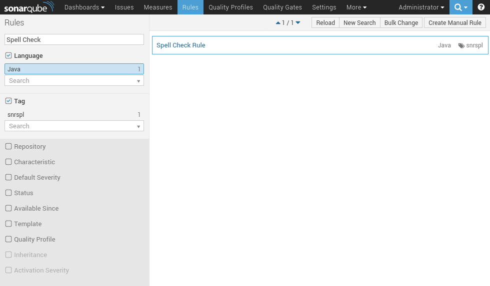
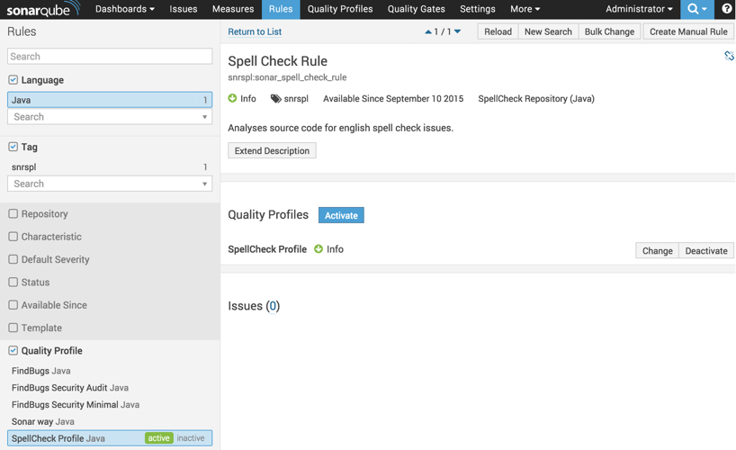
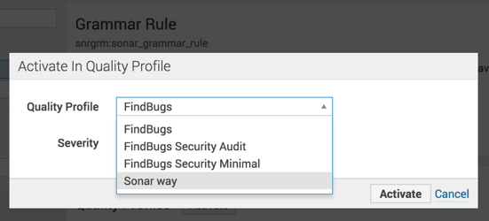
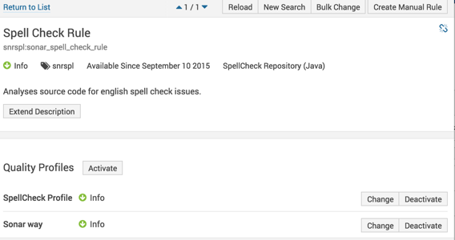
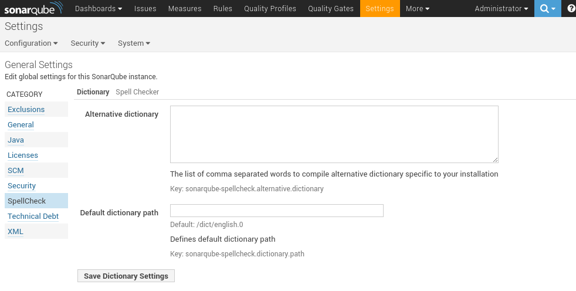
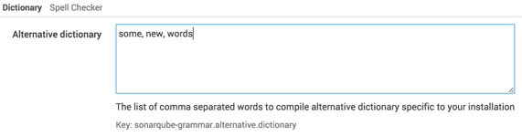
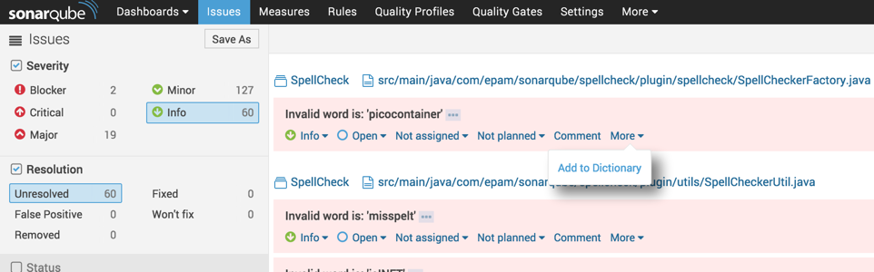
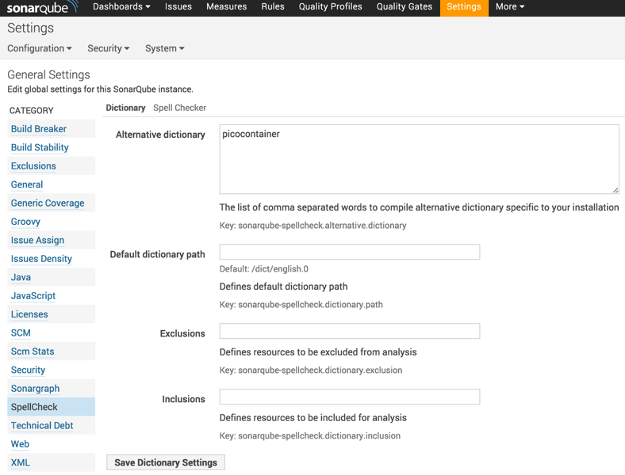

sonarqube-spellcheck
=============

[SonarQube](http://www.sonarqube.org/) SpellCheck Plugin to provide spell checking of source code (for now only Java). 

Status
------

[](https://travis-ci.org/webdizz/sonarqube-spellcheck)
[](https://bitdeli.com/free "Bitdeli Badge")

Usage
=====

Activate SpellCheck rule for your ```Quality Profiles```
--------------------------------

1. Go to ```Quality Profiles``` and click on ```SpellCheck Profile```' rule 
    
2. Page with ```SpellCheck Profile``` rules will be opened, here click on ```SpellCheck Rule``` and then on ```Activate```
    
3. In appeared dialog box select required profile to activate rule for and lick ```Activate``` 
    
4. ```SpellCheck Rule``` will be activated in selected profile, in our case ```Sonar Way``` profile
    

Add word/amend dictionary with custom words:
--------------------------------
You can add custom dictionary in ```SpellCheck Plugin Settings```:

1. Go to ```Settings->General Settings->SpellCheck```.
    
2. Add word to textarea ```Alternative dictionary``` (separated with comma)
    
3. Click ```Save SpellCheck Settings```

Add word/amend dictionary from ```Issue```:
--------------------------------

1. Go to your projects ```Issues``` tab
    
2. Find SpellCheck ```Issue``` of the word that is unknown by plugin, however is OK for your project, click on ```More```->```Add to Dictionary``` 
    
3. Word will be added to your ```Alternative dictionary```
    

Development
===========

Environment requirements:
-------------------------
1. [Java](http://www.oracle.com/technetwork/java/javase/downloads/index.html) 1.7
2. [Maven](https://maven.apache.org/)
3. [SonarQube](http://www.sonarqube.org/) (current version 5.1)

Development Set Up:
-------------------
1. Download [SonarQube](http://www.sonarqube.org/) (current version 5.1) from  [SonarQube homepage](http://www.sonarqube.org/downloads/)
2. Unpack and go to **sonarqube-5.1/conf** folder
3. Enable the development mode on server : add ```bash sonar.dev=true``` to **sonar.properties** . For Windows machines use ```sonar.dev=true```.
4. Go to folder **sonarqube-5.1/bin**. Select you current OS and run [SonarQube](http://www.sonarqube.org/) (can be ".bat" or ".sh" file)
5. In browser go to - [http://localhost:9000/](http://localhost:9000/)
6. Login in [SonarQube](http://www.sonarqube.org/) as Administrator (login - **admin**, password - **admin**)
7. On [SonarQube](http://www.sonarqube.org/) page top menu go to the "Quality Profiles". You need to make sure that "Sonar way " stands as the default

Development and run:
-------------------
1. Make some code changes
2. **Build** and **install** the plugin : ```bash mvn package org.codehaus.sonar:sonar-dev-maven-plugin::upload -DsonarHome={sonarqube-5.1} -DsonarUrl=http://localhost:9000``` . Use correct location of Sonarqube for the parameter -DsonarHome, for example ```-DsonarHome=d:\Sonar5.1```
3. Restart [SonarQube](http://www.sonarqube.org/)
4. Change on [SonarQube](http://www.sonarqube.org/) page top menu "Quality Profiles" ```Sonar SpellCheck Profile``` to default. 
5. To perform spell check analysis go to the project that you want to test and write ```bash mvn sonar:sonar``` command (for Windows machines use ```mvn sonar:sonar```), for debug use ```bash mvnDebug sonar:sonar``` command (by default debug port is **8000**)
6. After that you can see results on [http://localhost:9000/dashboard/](http://localhost:9000/dashboard/) or follow the link that will be found in the bottom of command line output
7. To analyse using Docker based installation execute ```mvn sonar:sonar -Dsonar.host.url=http://192.168.176.128:9000/ -Dsonar.jdbc.url=jdbc:mysql://192.168.176.128:3306/sonarqube -Dsonar.jdbc.username=sonarqube -Dsonar.jdbc.password=sonarqube```

Amend default dictionary:
-----------------
There is built in dictionary, however to add additional words here is a bash script to rearrange dictionary.
To do this - append new word to **src/main/resources/dict/english.0**, run **reprocess_dict.sh** after that copy **src/main/resources/dict/english.1** with new word and in correct format to **src/main/resources/dict/english.0**.
